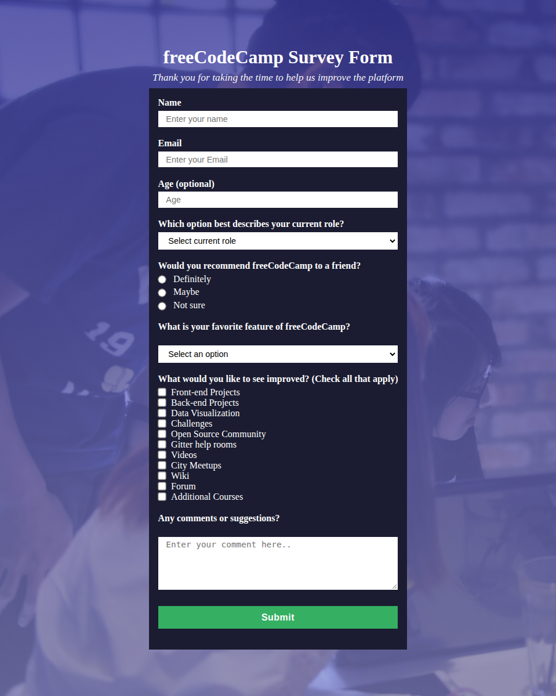

# 📋 Simple Survey Form — HTML Project

A beginner web project that creates a simple survey form using HTML.
The form collects user information and demonstrates how basic HTML form elements work.
This project is perfect for learning how to build and structure forms on a web page.

## 🎯 Project Goals

This project aims to:

Learn the basics of HTML forms
Understand how to use input fields
Practice radio buttons and checkboxes
Build a simple user survey page
Understand how form data is structured

## The survey includes

Text inputs, Email input, Radio buttons, Checkboxes, Dropdown menu, Submit button and form layout.

🛠 Tech Stack

Language
-HTML5

Tools
-VS Code
-Git & GitHub

## 📂 Project Files

survey-form/
│
├── survey.html
└── README.md

▶️ How To Run
Download or clone the project
Open the file in your browser

You can simply double-click:

index.html

Or open using terminal:

open index.html

## deployment link

<https://mike2377.github.io/survey_form/>

## 📷 Example Page

## 🧠 What You Learn From This Project

Creating HTML forms
Using different input types
Understanding form structure
Building interactive web pages
Practicing semantic HTML

📚 HTML Concepts Covered

Text input field
Email input validation
Radio buttons (single choice)
Checkboxes (multiple choice)
Dropdown select menu
Textarea for comments
Submit button

👨🏽‍💻 Author

Kembou Keumoe Ivan Michael
Junior Fullstack Developer
📩 Email: <kman39457@email.com>

🌍 Based in Cameroon | Open to remote opportunities
